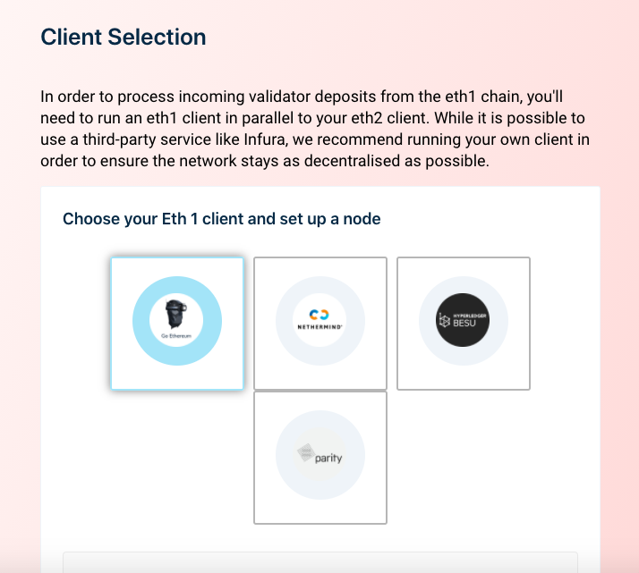
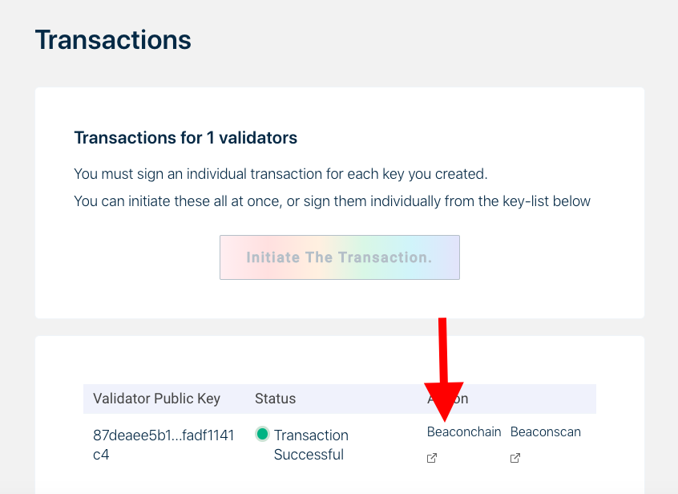
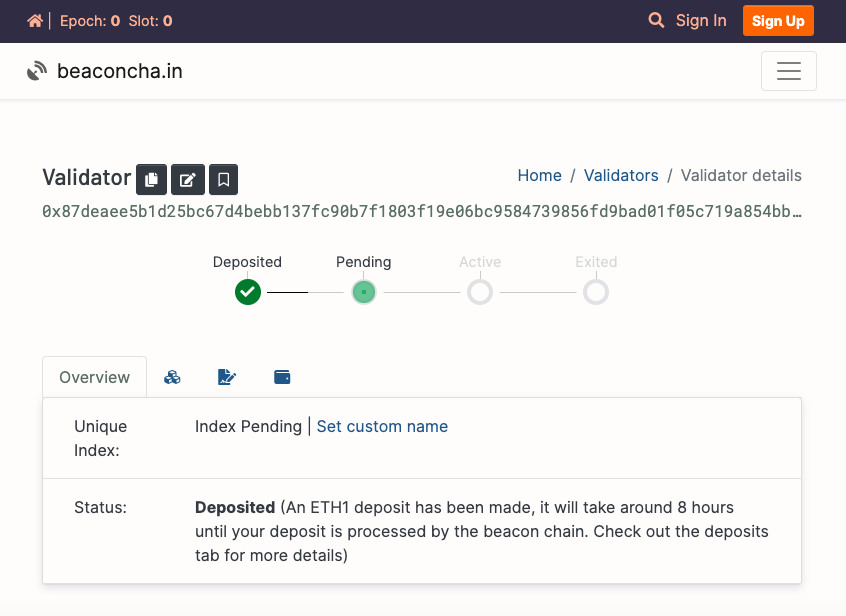

# 11. バリデータのデポジットをする

最も簡単なデポジット方法は、こちらの Ethereum Foundation のローンチパッドの指示に従うことです。

**Mainnet**: [https://launchpad.ethereum.org/](https://launchpad.ethereum.org/)


メインネットでデポジットをする場合は、やり取りしているデポジットコントラクトが正しいかどうかを確認してください。

アドレスが正しいか十分に確かめてください。[0x00000000219ab540356cBB839Cbe05303d7705Fa](https://etherscan.io/address/0x00000000219ab540356cBB839Cbe05303d7705Fa)


個々のステップについては、サイト上で十分に説明されているので、ここでは詳しく説明しません。しかし、注意すべき点が2つあります。

### 1. eth1への接続

`Select Client` セクションでは、まずeth1クライアントを選択するように求められます。eth1チェーンからのバリデータデポジットを処理するには、eth1クライアントを実行する必要があります。

`Go Ethereum`（または`Geth`）を選ぶことをお勧めします。

_ここまで本の内容を追ってきたのであれば、すでにGethを立ち上げているはずです。_

### 2. ブロックエクスプローラ

トランザクションを送信すると、以下のような画面が表示されるはずです。

`Beaconchain`をクリックすることをお勧めします。これにより、バリデータの状態を追跡するためのウィンドウが開きます。

このサイトをブックマークしておくとよいでしょう。

### 予想される待ち時間（キュー）

トランザクションを送信すると、あなたのバリデータはデポジット時間に応じて順番待ちの状態になります。順番待ちの列を通過するには、数時間から数日かかる場合があります（チェーンが確定していると仮定します）。チェーンが確定していない間は、バリデータセットにバリデータを登録することはできません。

