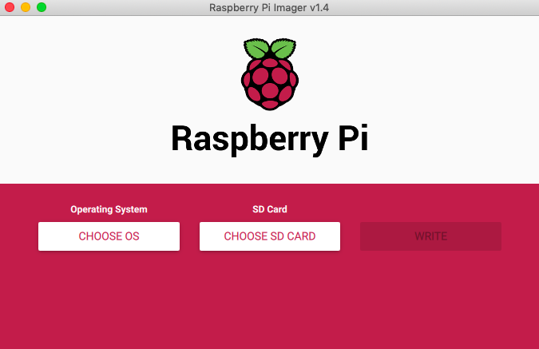
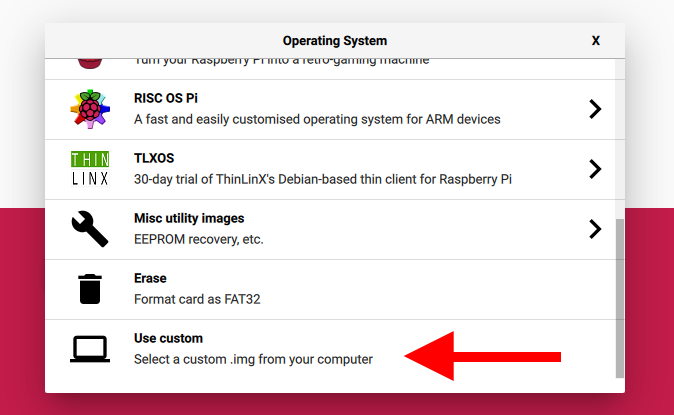
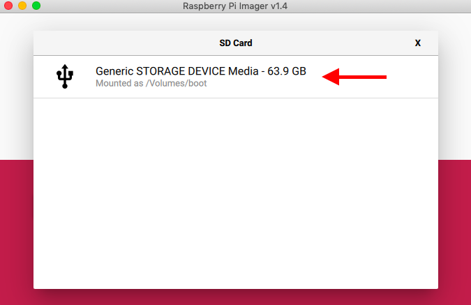
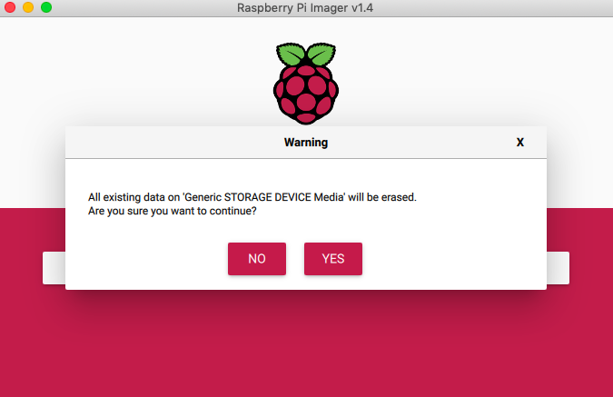

# 5. Raspberry Piのバリデート：ガイド



## イントロダクション

このページでは、ラップトップを使って Raspberry Pi をプログラミングし、Nimbus を動作させ、Pyrmont testnet に接続する方法を紹介します。

Raspberry Pi を体験する上で最も重要なことの一つは、できるだけ簡単に始められるようにすることです。そのため、第一原理から説明することに最善を尽くしています。

## 前提条件

* Raspberry Pi 4 \(4GB RAMオプション\)
* 64GBのmicroSDカード
* microSD USBアダプタ
* 5V 3A USB-C 充電器
* 信頼性の高いWifi接続
* ラップトップ
* [コマンドライン](https://www.learnenough.com/command-line-tutorial/basics)の基本的な理解
* 160GB SSD


Nimbusを実行するにはSSDが必要です（SSDドライブがないとEthereumブロックチェーンを同期することができません）。あなたには2つのオプションがあります。

1. Samsung T5 Portable SSD のようなUSBポータブルSSDディスクを使用する。
2. SSDディスクとUSB 3.0外付けハードドライブケースを使用する。例えば、Ethereum on Arm では、Inateck 2.5 Hard Drive Enclosure FE2011 を使用しています。UASP準拠のチップを搭載したケース、特にこれらのうちの1つを購入するようにしましょう。JMicron \(JMS567 または JMS578\) または ASMedia \(ASM1153E\) です。

どちらの場合も、低品質のSSDディスクは避けてください（SSDはノードの重要なコンポーネントであり、パフォーマンスと同期時間の両方に大 きく影響します）。ディスクをUSB 3.0ポート（青色のポート）に接続する必要があることを覚えておいてください。


## 1. Raspberry Pi Imagerをダウンロード

[Raspberry Pi Imager](https://www.raspberrypi.org/blog/raspberry-pi-imager-imaging-utility/) は、Raspbian \(DebianベースのフリーのPiオペレーティングシステム\) を使って microSDカードを簡単に管理できるようにする新しい画像処理ユーティリティです。

お使いのオペレーティングシステムの[ダウンロード](https://www.learnenough.com/command-line-tutorial/basics)リンクはこちらです：[Windows](https://downloads.raspberrypi.org/imager/imager_1.4.exe)、[macOS](https://downloads.raspberrypi.org/imager/imager_1.4.dmg)、[Ubuntu](https://downloads.raspberrypi.org/imager/imager_1.4_amd64.deb)

## 2. Raspian 64-bit OS \(Beta\) のダウンロード

最新バージョンは[こちら](https://downloads.raspberrypi.org/raspios_arm64/images/)からどうぞ。

## 3. SDカードを接続する

microSD USBアダプタを使用して、SDカードをコンピュータに接続します。

## 4. Raspberry Pi OS をダウンロードする

Raspberry Pi Imager を開き、**CHOOSE OS** をクリックします。

下にスクロールして、**Use custom** をクリックします。

ステップ2でダウンロードしたOSを指定します。

## 4b. SDカードに書き込む

**CHOOSE SD CARD** をクリックしてください。SDカードの一覧のポップアップメニューが表示されます。選択します。

**WRITE** をクリックします。

**YES** をクリックします。

コーヒーを淹れましょう :\) （※しばらく時間がかかるという意味です）

## 5. 無線LANの設定

