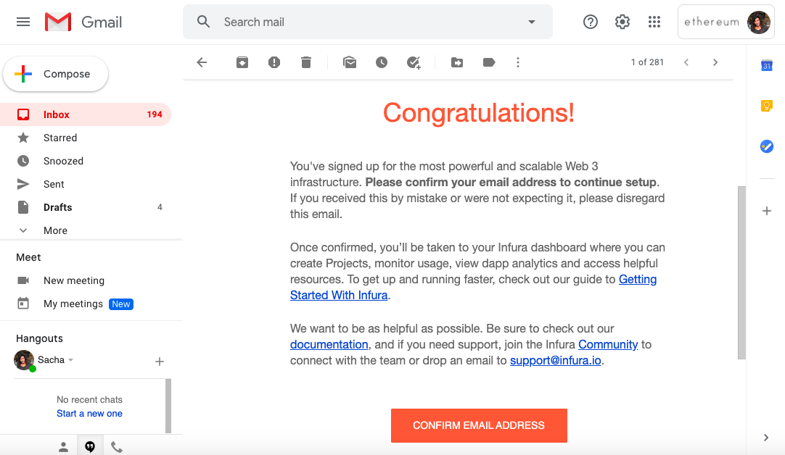

# 26. Infuraエンドポイントを作成する

簡単に言うと、Infura はホスト型の ethereum ノードクラスタで、自分で eth1 ノードをセットアップしなくても eth1 ブロックチェーンへのリクエストを行うことができます。

Infura はバリデータのデポジットを処理するようにサポートしていますが、サードパーティのサービスに依存しないように、独自の eth1 ノードを実行することをお勧めします。


Nimbus は現在、リモートの Infura ノードとローカルの Geth ノードをサポートしています。将来的には、独自の eth1 クライアントである Nimbus 1 を推奨デフォルトにする予定です。


### 1. Infura.io にアクセスする

こちらにアクセスします。

[https://infura.io/](https://infura.io/)

`Get Started For Free`をクリックします。

### 2. サインアップする

メールアドレスを入力してパスワードを作成します。

### 3. メールアドレスVerifyする

Infura からのメールが受信トレイに届いているはずです。それを開いて`Confirm Email Address`をクリックしてください。

### 4. ダッシュボードに行く

Infura のダッシュボード \([https://infura.io/dashboard/](https://infura.io/dashboard/)\) に移動します。

### 5. プロジェクトを作成する

`Let's Get Started` の下にある最初のオプション（`create your first project`）をクリックしてください。

プロジェクト名を入力します。

新しく作成したプロジェクトの設定ページに移動します。

※ 6. は省略します。

### 7. websocket エンドポイントをコピーする

`wss://` から始まるアドレスをコピーします。


警告:  https エンドポイントではなく、wss \(websocket\)  から始まるエンドポイントをコピーしてください。mainnet に接続している場合は`wss://mainnet.infura.io/ws/...` という表示になっています。


### 8. ビーコンノードの実行

[ビーコンノードを起動する](https://haruki.gitbook.io/nimbus-book-ja/how-to/10-sync-the-beacon-node)際に、[Web3プロバイダ URL](https://haruki.gitbook.io/nimbus-book-ja/how-to/10-sync-the-beacon-node#web-3-purobaida-url) として Websocket エンドポイントを指定します。

### 9. Statsをチェックする

プロジェクトの統計ページにアクセスして、eth1 関連のアクティビティとメソッドコールの概要を確認してください。

これで以上です :\)

